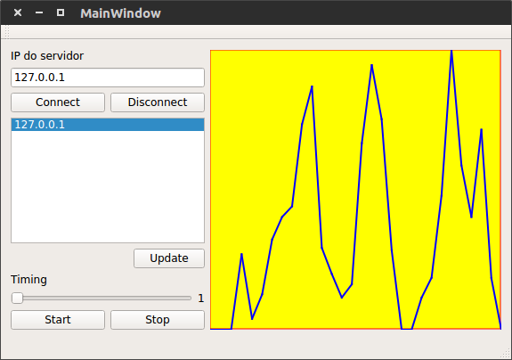

# Projeto de Programação 

## Apresentação 

O presente projeto visa desenvolver o aluno na prática de programação
orientada a objetos usando a biblioteca Qt.

O projeto consiste em três programas de computador que trabalham em
conjunto para simular um sistema simples de aquisição e supervisão de
dados usando comunicação TCP/IP em uma rede local.

Em suma, os três módulos devem ser capazes de realizar as seguintes
operações:

- O **servidor** deve esperar conexões TCP destinadas à porta 1234, e
  responder ao cliente conforme os comandos que este enviar.
- O **cliente produtor** de dados deve ser capaz de se conectar a uma
  máquina executando o servidor na porta 1234 e enviar, usando
  comandos específicos, marcações de data/hora juntamente com uma
  informação em ponto flutuante para ser gravada.
- O **cliente supervisor** de dados deve ser capaz de se conectar a uma
  máquina executando o servidor na porta 1234 e recuperar, usando
  comandos específicos, a lista dos clientes produtores de dados, bem
  como listagens de dados produzidos por um destes clientes
  produtores.

O aluno deverá desenvolver apenas os **cliente produtor** e o
**cliente supervisor**. O módulo **servidor** já está pronto e não
precisa ser trabalhado.


## O módulo servidor

O módulo servidor implementa o que se chama de servidor TCP. Em outras
palavras, esse programa é capaz de escutar a rede local e aguardar por
conexões remotas destinadas à porta TCP/1234.

Em redes TCP/IP, o protocolo de comunicação TCP permite a criação de
um circuito virtual, um canal de comunicação que pode ser usado para
enviar e receber sequências de bytes pela Internet. O canal é fechado
apenas quando a conexão é interrompida.

Para se abrir uma conexão com uma máquina que executa um determinado
serviço usando o protocolo TCP é necessário que se conheça seu
endereço IP (ou nome) e uma _porta_ onde o serviço será
provido. Quando a conexão é aberta para um novo cliente, inicia-se um
_socket_ de comunicação, identificado, entre outras coisas, pela
combinação IP+porta. Cada _socket_ possui um número único que
pode ser usado para distinguir entre as várias conexões que podem
chegar à mesma porta. Isso é comum em máquinas que provêem serviços a
vários clientes.

Máquinas que aguardam conexões comumente chamadas de **servidores**. O
servidor implementado neste projeto _escuta_  a porta **1234**. Uma
vez que um cliente se conecte a esta, as tarefas que o servidor irá
executar dependerão de mensagens enviadas pelo cliente. Para cada
mensagem, uma tarefa diferente é executada. É dessa maneira que os
vários serviços na Internet funcionam.

O servidor do projeto não necessita de modificações para
funcionar. Basta abrir o projeto no QtCreator, compilar e executar o
código. O servidor é capaz de interpretar mensagens em texto simples
que lhe forem enviadas. As mensagens aceitas pelo servidor formam o
que se chama de **protocolo de aplicação** para este serviço. Três
mensagens são suportadas nesse protocolo:

```
list
get NUMERO_IP N_AMOSTRAS
set DATA_E_HORA_EM_MS DADO
```

O comando **_list_** retorna a lista de máquinas cujos dados
produzidos encontram-se armazenados no servidor. ex:
```
$ telnet 127.0.0.1 1234
list
127.0.0.1
```

O comando **_get_** precisa que se forneça também o número IP do
**cliente produtor** que se deseja recuperar o conjunto de dados
produzidos. ex:

```
$ telnet 127.0.0.1 1234
get 127.0.0.1 1
1496658174409 34
```

O comando **_set_** precisa que se forneça uma combinação DATA e HORA,
bem como o dado que se deseja armazenar no servidor. ex:

```
$ telnet 127.0.0.1 1234
set 127.0.0.1
set 1496658174409 34
```

Todos os comandos devem ser enviados na forma de literais. O indicador
de data/hora é um long que armazena a quantidade de milisegundos
passados desde a data 1/1/1970. O servidor, uma vez que receba essas
sequências de literais, separa-as conforme a quantidade de espaços
presentes e armazena os dados associados em uma estrutura local criada
para esse fim.

Em se tratando de um projeto meramente acadêmico, pouco controle de
erro é realizado nessa versão inicial.

Quando o servidor é executado, uma mensagem é exibida na aba
**Application Output** do QtCreator mostrando o IP local do servidor,
como ilustram as linhas a seguir:

```
server started at:
"192.168.1.106"
```

## O módulo cliente produtor de dados

O cliente produtor de dados deve ser capaz de se conectar a um
servidor em execução e enviar comandos **set** para este
servidor. Espera-se que esse módulo seja capaz de simular um processo
de coleta e envio de dados para o servidor em intervalos periódicos.

A construção do cliente deve possibilitar o envio de dados
(possivelmente aleatórios) para o servidor em intervalos regulares de
tempo. Para isso, seu usuário deverá ser capaz de realizar as
seguintes operações no módulo produtor:

- Indicar o IP do servidor ao qual se deseja conectar
- Indicar a faixa de valores (min-max) que poderão ser enviados ao servidor
- Indicar o intervalo de tempo entre o envio de dois dados consecutivos
- Realizar a conexão ao pressionar um botão
- Iniciar a transmissão de dados ao pressionar um botão
- Finalizar a transmissão de dados ao pressionar um botão
- Exibir os dados enviados em uma janela de texto

Um exemplo de interface para o módulo produtor de dados é mostrado na
figura que segue:


## Consumidor de dados

O consumidor de dados assume um papel mais complexo que o produtor. O
consumidor deve ser capaz de se conectar a um servidor indicado,
recuperar os endereços das máquinas que produziram dados e traçar um
gráfico data-hora x valor de uma sequência de dados fornecida pelo
servidor.

O usuário do módulo consumidor de dados, o usuário deverá ter à sua
disposição as seguintes funcionalidades:

- Indicar o endereço IP do servidor de dados ao qual o cliente deverá
  se conectar.
- Iniciar a conexão com o servidor ao se pressionar um botão.
- Uma vez conectado, o usuário deverá ter a disposição uma lista das
  máquinas que produziram dados no servidor. Isso pode ser
  implementado usando um **listwidget**.
- No **listwidget** o usuário deverá ser capaz de selecionar a máquina
  cujos dados deseja visualizar.
- O botão **update**, quando pressionado, deve promover a atualização da
  lista de máquinas que estão produzindo dados no servidor.
- Com uma máquina selecionada, dois botões deverão ficar disponíveis
  para o usuário: um para começar a receber os dados e outro para
  parar de receber.
- Deverá ficar disponível a possibilidade de modificar o intervalo de
  tempo de captura entre dois conjuntos de dados consecutivos, ou
  seja, entre o envio de dois comandos _get .

Para cada recepção de dados, a ferramenta deverá traçar o gráfico
tempo x valor do conjunto de dados lido do servidor. Algumas formas de
traçado podem ser consideradas:

- Traçar todo intervalo de valores lido do servidor.
- Traçar um subintervalo dos valores lidos (ex: desenhar apenas as
  últimas 30 amostras obtidas). Isso pode interessante para evitar que
  o gráfico fique sobrecarregado.

Um exemplo de interface para o módulo consumidor de dados é mostrado na
figura que segue:



